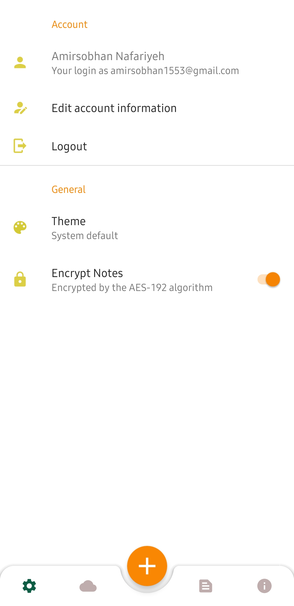

# StickMe Note 📝
A simple cloud-based notebook app that works with **Google Firebase**.This app was developed with **Kotlin** & **Koin** service-locator

**StickMe Note** app is built with **Kotlin**, **Koin** and **Firebase** also Room database used to store notes in a device local storage and use Firebase firestore to save them in cloud

## Built with: 🛠

 - [Koin Dependency Injection](https://github.com/InsertKoinIO/koin)
 - [Room](https://developer.android.com/jetpack/androidx/releases/room)
 - [Firebase(Authentication, Firestore, Storage, Crashlytics, Remote Config & Cloud messaging)](https://firebase.google.com/docs)
 - [Lifecycle & LiveData](https://developer.android.com/topic/libraries/architecture/livedata)
 - [ViewModel](https://developer.android.com/topic/libraries/architecture/viewmodel)
 - [WorkManager](https://developer.android.com/topic/libraries/architecture/workmanager)
 - [Navigation Components](https://developer.android.com/guide/navigation)
 - [Gson](https://github.com/google/gson)
 - [About Page](https://github.com/medyo/android-about-page)
 - [PhoneEmoji](https://github.com/tfcporciuncula/phonemoji)
 - [Picasso](https://github.com/square/picasso)
 - [RichEditor](https://github.com/wasabeef/richeditor-android)
 - [Espresso](https://developer.android.com/training/testing/espresso)
 - [Truth](https://truth.dev/)

## Screenshots 🖼
|  |  |  | 
|--|--|--|--|
|  |  |  | 
|  |  | 

  
# Find it interesting? ❤️
###  Support me by giving ⭐ to this repository.
